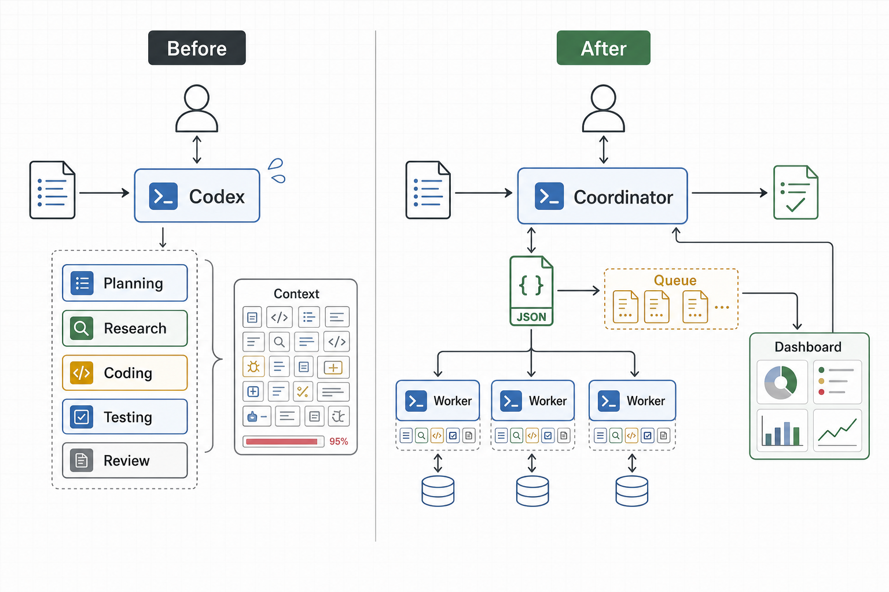
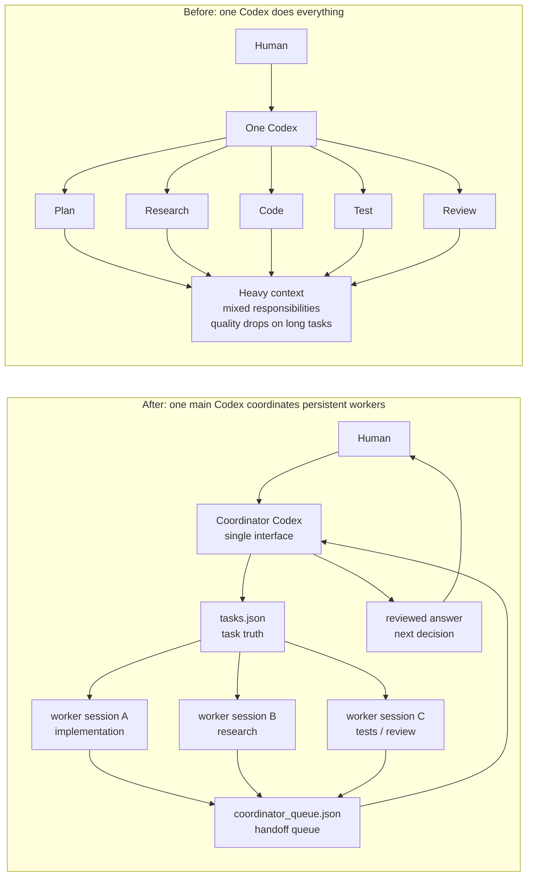
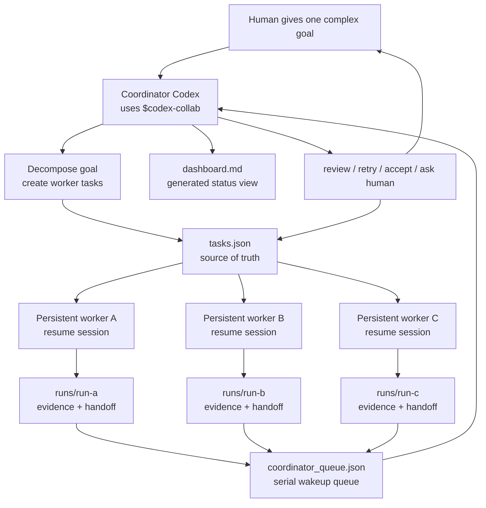

# Codex Collab

[中文](README.md) · English



> Human-facing product page. The Agent runtime entry is [SKILL.md](SKILL.md), and deeper design notes live in [references/](references/).

#### 🧭 Give one main Codex a coordinator skill

Most people do not want to manually operate a multi-agent framework. They want to give one Codex session a complex goal and keep talking to that one main Codex.

The usual problem is that one Codex has to do everything by itself: understand the goal, split the work, research, code, test, review, and keep track of what happened. On long tasks, quality drops and the context gets heavy.

Codex Collab is not framed as "humans managing multiple agents." It is a skill that lets the main Codex become a coordinator. You still talk to one Codex. That Codex can decompose the goal, dispatch subtasks to persistent worker Codex sessions, collect handoffs, review them in order, and report the next decision back to you.

In short:

- 👤 the human talks to one main Codex
- 🧠 the main Codex plans, decomposes, maintains the dashboard, and makes final decisions
- 🛠️ worker Codex sessions handle implementation, research, tests, or review tasks
- 🔁 workers put results into a durable queue for the coordinator
- 📦 intermediate state is stored in local JSON and run artifacts, so long work can recover

Under the hood, it uses multiple persistent sessions. The user-facing experience should feel like **one better-organized Codex that can find persistent helper sessions for itself**.

The current implementation and validation are Codex-first. Other Agents can port the JSON-first protocol, but they need their own launch, resume, permission, and session-management adapters.

---

## ✨ Highlights

- 🧭 **Single interface**: the human talks to the main Codex; the main Codex coordinates the rest.
- 🧑‍🏭 **Persistent worker sessions**: workers can use `sessionId` and `resume` to keep their own context.
- 🧠 **Better than throwaway subagents for long work**: workers can be resumed instead of recreated from scratch, so long tasks do not need repeated context loading.
- 🔎 **Open the worker anytime**: execution sessions are not a sealed box; you can inspect, take over, or continue a worker session directly.
- 🧾 **Traceable evidence**: every attempt has a run folder, log, handoff, and queue event, so coordinator review has something concrete to inspect.
- 📋 **JSON-first state**: `tasks.json` is the source of truth, so workers do not scrape Markdown tables.
- 🔔 **Explicit callback queue**: worker completion writes `coordinator_queue.json`; the main Codex is woken in order.
- 📊 **Dashboard view**: `dashboard.md` is rendered from JSON for humans and Codex to scan.
- 🧯 **Long-running recovery**: locks, heartbeat, stale recovery, and `repair-queue` handle crashes and missed wakeups.

---

## 🚀 Ask Codex To Install It

Paste this into Codex:

```text
Please install this skill: https://github.com/ZelongTAN/tot-skills/tree/main/skills/codex-collab
```

After installation, ask:

```text
Use $codex-collab to set up a workspace where the main Codex coordinates worker Codex sessions.
Act as the coordinator: decompose complex tasks, assign worker tasks, maintain the dashboard, and review worker handoffs.
```

Platform notes:

- ✅ Windows / macOS / Linux are supported
- ✅ the core runner is pure Python plus local JSON files; no server or database required
- ✅ live Codex worker runs require a working local `codex` CLI
- ✅ Claude Code / OpenCode / OpenClaw and similar tools can port the protocol, but need their own launch, resume, permission, and session adapters

---

## 🌗 Why This Exists



The old pain is not that humans cannot open several Codex windows. The pain is that, once they do, they become the scheduler: copying tasks, forwarding results, tracking status, deciding what finished, what blocked, and what should happen next.

Codex Collab turns that into a local coordination protocol that the coordinator Codex can operate.

---

## 🧠 How It Works



Key points:

- Workers read `tasks.json` and their task snapshot, not `dashboard.md`.
- Worker completion follows a fixed exit path that writes a handoff and queue event.
- Multiple workers can finish in parallel, while the main Codex reviews queue events serially.
- If a process crashes after updating a task but before enqueueing, `repair-queue` can rebuild the missing event from `tasks.json`.
- `dashboard.md` is only a view; JSON remains the source of truth.

---

## 🧱 What It Does Not Do

- It does not guarantee a worker's code is correct.
- It does not solve git conflicts automatically.
- It does not make multiple workers editing the same files safe by itself.
- It does not require a server, database, daemon, or filesystem watcher.
- It does not promise non-Codex Agents work out of the box.
- It does not try to become a full project management system.

---

<details>
<summary>Manual install, commands, and implementation details</summary>

## Install The Runner Manually

If you have cloned this repository, install the runner into any project from the repo root:

```bash
python skills/codex-collab/scripts/collab.py install --target /path/to/project --dashboard
```

It creates:

```text
.codex-collab/
  collab.py                CLI and runner
  config.json              workers and coordinator settings
  tasks.json               task source of truth
  coordinator_queue.json   coordinator wakeup queue
  dashboard.md             generated readable dashboard
  runs/                    worker run evidence
  state/                   locks, heartbeats, stop files
```

## Dry-run / Exercise-flow

`--dry-run` is a read-only preview. It only shows which task would be claimed or which queue event would be processed; it does not modify `tasks.json`, `coordinator_queue.json`, `runs/`, or `state/`.

If you want to rehearse the whole local state flow without launching real Codex, use `--exercise-flow` explicitly on a disposable smoke task.

```bash
cd /path/to/project
python .codex-collab/collab.py doctor
python .codex-collab/collab.py validate
python .codex-collab/collab.py new-task --owner worker-a --title "Smoke test" --goal "Verify collaboration flow"
python .codex-collab/collab.py start-worker --worker worker-a --dry-run --once
python .codex-collab/collab.py run-coordinator --dry-run --once
python .codex-collab/collab.py start-worker --worker worker-a --exercise-flow --once
python .codex-collab/collab.py run-coordinator --exercise-flow --once
python .codex-collab/collab.py status
```

## Live Use

Configure `.codex-collab/config.json`:

```json
{
  "workers": {
    "worker-a": {
      "cwd": ".",
      "useResume": true,
      "sessionId": "worker-codex-session-id",
      "model": "gpt-5.4",
      "reasoningEffort": "xhigh",
      "sandbox": "workspace-write"
    }
  },
  "coordinator": {
    "sessionId": "main-codex-session-id",
    "model": "gpt-5.4",
    "reasoningEffort": "xhigh"
  }
}
```

You can also override these for one live loop:

```bash
python .codex-collab/collab.py start-worker --worker worker-a --model gpt-5.4 --reasoning-effort xhigh
python .codex-collab/collab.py run-coordinator --model gpt-5.4 --reasoning-effort xhigh
```

Then run:

```bash
python .codex-collab/collab.py doctor --live
python .codex-collab/collab.py start-worker --worker worker-a
python .codex-collab/collab.py run-coordinator
```

For code-changing workers, separate git worktrees are strongly recommended. Codex Collab handles handoff, queueing, and records; it does not magically remove file conflicts.

## Task States

| State | Meaning |
|---|---|
| `pending` | Ready for worker pickup |
| `needs-approval` | Waiting for human approval |
| `running` | Claimed by a worker |
| `review` | Handoff is ready for coordinator review |
| `blocked` | Dependency, context, or design issue |
| `needs-human` | Worker explicitly needs a human decision |
| `failed` | Failed, timed out, stale, or missing handoff |
| `done` | Accepted or explicitly complete |
| `parked` | Paused |

Approve high-risk work:

```bash
python .codex-collab/collab.py approve <task-id>
```

## Reset Test State

```bash
python .codex-collab/collab.py clean --runs --state --reset-tasks --queue --force
```

Without `--force`, `clean` refuses to run while tasks are still marked `running`.

</details>

---

## 📁 Skill Layout

```text
README.md                  human-facing product page
README.en.md               English product page
SKILL.md                   Agent runtime entry
scripts/collab.py          cross-platform runner CLI
references/usage.md        user manual
references/design.md       architecture and reliability notes
agents/openai.yaml         skill UI metadata
```

---

<details>
<summary>Development checks</summary>

```bash
python -m py_compile skills/codex-collab/scripts/collab.py
python skills/codex-collab/scripts/collab.py install --target /tmp/codex-collab-smoke --dashboard
python /tmp/codex-collab-smoke/.codex-collab/collab.py doctor
python /tmp/codex-collab-smoke/.codex-collab/collab.py validate
```

If you have Codex's skill validator:

```bash
python path/to/quick_validate.py skills/codex-collab
```

</details>
