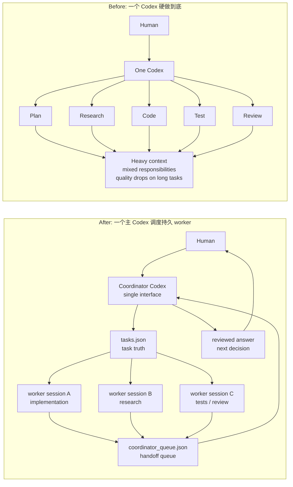
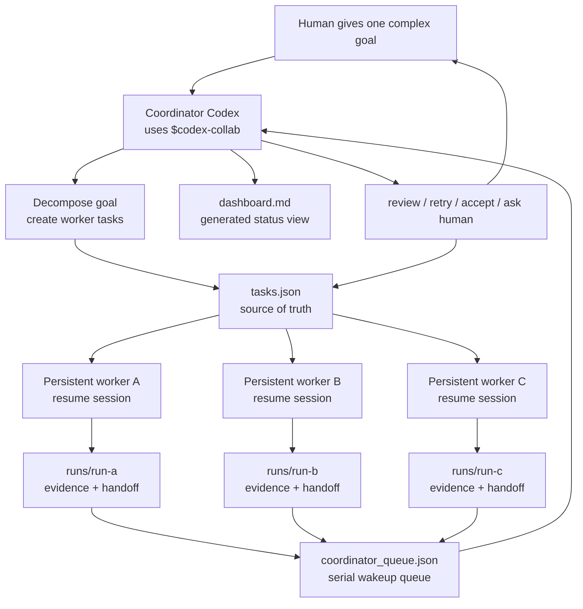

# Codex Collab

中文 · [English](README.en.md)

> 人看的产品页。Agent 运行时入口在 [SKILL.md](SKILL.md)，深入设计在 [references/](references/)。

#### 🧭 给一个主 Codex 装上“调度员能力”

很多时候，我们并不是想自己管理一堆 Agent。我们只是想把一个复杂任务交给 Codex，然后继续和一个主 Codex 对话。

但普通做法里，这个主 Codex 往往只能自己一路做到底：它要理解需求、拆任务、查资料、写代码、跑测试、审查结果。任务一复杂，质量就容易下降，上下文也会变重。

Codex Collab 的切入点不是让人手动操作一个“多 Agent 框架”，而是给 Codex 装一个协作 skill：你仍然只和一个主 Codex 对接；这个主 Codex 可以把自己升级成 coordinator，自己拆解任务、把子任务分配给持久 worker 会话、收集 handoff、排队审查，再把结论交还给你。

换句话说：

- 👤 人只需要面对一个主 Codex
- 🧠 主 Codex 负责理解目标、拆解任务、维护 dashboard、做最终判断
- 🛠️ worker Codex 会话负责具体执行、调研、测试、审查等子任务
- 🔁 worker 完成后自动把结果放进队列，主 Codex 按顺序处理
- 📦 所有中间状态都落在本地 JSON 和 run artifacts 里，可以长时间运行和恢复

它本质上用了多个持久会话协作，但用户体验应该是：**一个更会组织工作的 Codex，自己找持久会话帮手。**

当前实现和验证优先围绕 Codex。其他 Agent 可以参考这套 JSON-first 协议迁移，但需要替换启动、resume、权限和会话管理适配层。

---

## ✨ 核心亮点

- 🧭 **单一对接口**：人只和主 Codex 沟通，主 Codex 负责拆解和调度。
- 🧑‍🏭 **持久 worker 会话**：worker 可以配置 `sessionId`，用 `resume` 保留自己的上下文。
- 🧠 **比子 Agent 更适合长任务**：worker 是可恢复的持久会话，不是一次性调用；长期任务不用每次重新灌上下文。
- 🔎 **随时可以打开 worker 看现场**：执行会话不是黑盒，你可以自己切进去查看、接管、继续聊。
- 🧾 **证据链更完整**：每次执行都有 run folder、日志、handoff 和 queue event，主 Codex 审查时有东西可追。
- 📋 **JSON-first 状态**：`tasks.json` 是任务真相源，避免从 Markdown 表格里猜状态。
- 🔔 **显式回调队列**：worker 完成后写入 `coordinator_queue.json`，主 Codex 被按队列唤醒。
- 📊 **Dashboard 视图**：`dashboard.md` 从 JSON 渲染，方便人和 Codex 快速扫描。
- 🧯 **长时间运行恢复**：锁、heartbeat、stale recovery、`repair-queue` 用来处理崩溃和漏通知。
- 🧪 **Dry-run 先验证**：不启动真实 Codex，也能先跑通任务、worker、handoff、queue。

---

## 🚀 让 Codex 直接安装

把这句话复制给 Codex：

```text
请帮我安装这个 skill：https://github.com/ZelongTAN/tot-skills/tree/main/skills/codex-collab
```

安装后，在你的项目里这样说：

```text
使用 $codex-collab，在当前项目里设置一个由主 Codex 调度 worker Codex 的协作工作区。
之后你作为 coordinator，帮我拆解复杂任务、分配给 worker、维护 dashboard，并审查 worker 的 handoff。
```

平台说明：

- ✅ Windows / macOS / Linux 都可以使用
- ✅ 核心 runner 是纯 Python 和本地 JSON 文件，不需要服务器或数据库
- ✅ 真实运行 Codex worker 时，需要本机有可用的 `codex` CLI
- ✅ Claude Code / OpenCode / OpenClaw 等其他 Agent 可以迁移协议，但需要自己的启动、resume、权限和会话适配层

---

## 🌗 为什么需要它



以前的问题不是“人不会开多个 Codex 窗口”，而是开了以后，人就变成了调度系统本身：复制任务、转发结果、记录状态、判断谁完成了、谁卡住了、下一步该怎么走。

Codex Collab 把这部分变成一个本地协作协议，让 coordinator Codex 自己维护状态和队列。

---

## 🧠 How It Works



关键点：

- worker 不需要读 dashboard；它们读 `tasks.json` 和自己的 task snapshot。
- worker 完成后通过固定结束路径写 handoff 和 queue event，不靠文件系统 watcher 猜。
- 多个 worker 可以并行完成，主 Codex 仍然按队列串行审查。
- 如果崩在“任务已更新但队列没写入”的窗口，`repair-queue` 可以从 `tasks.json` 补回事件。
- `dashboard.md` 只是给人和 coordinator 看的视图，真相仍然在 JSON。

---

## 🧱 它不做什么

- 不替你判断 worker 的代码一定正确。
- 不自动解决 git 冲突。
- 不保证多个 worker 同时改同一批文件是安全的。
- 不要求服务器、数据库、daemon 或文件系统 watcher。
- 不承诺非 Codex Agent 开箱即用。
- 不试图变成完整项目管理系统。

---

<details>
<summary>展开查看手动安装、命令和实现细节</summary>

## 手动安装 Runner

如果你已经 clone 了这个仓库，可以从仓库根目录把 runner 安装到任意项目：

```bash
python skills/codex-collab/scripts/collab.py install --target /path/to/project --dashboard
```

它会创建：

```text
.codex-collab/
  collab.py                CLI and runner
  config.json              workers and coordinator settings
  tasks.json               task source of truth
  coordinator_queue.json   coordinator wakeup queue
  dashboard.md             generated readable dashboard
  runs/                    worker run evidence
  state/                   locks, heartbeats, stop files
```

## Dry-run

```bash
cd /path/to/project
python .codex-collab/collab.py doctor
python .codex-collab/collab.py validate
python .codex-collab/collab.py new-task --owner worker-a --title "Smoke test" --goal "Verify collaboration flow"
python .codex-collab/collab.py start-worker --worker worker-a --dry-run --once
python .codex-collab/collab.py run-coordinator --dry-run --once
python .codex-collab/collab.py status
```

## Live Use

真实 worker 需要配置 `.codex-collab/config.json`：

```json
{
  "workers": {
    "worker-a": {
      "cwd": ".",
      "useResume": true,
      "sessionId": "worker-codex-session-id",
      "sandbox": "workspace-write"
    }
  },
  "coordinator": {
    "sessionId": "main-codex-session-id"
  }
}
```

然后运行：

```bash
python .codex-collab/collab.py doctor --live
python .codex-collab/collab.py start-worker --worker worker-a
python .codex-collab/collab.py run-coordinator
```

建议：会改代码的 worker 尽量放在不同 git worktree 里。Codex Collab 负责传递、排队和记录，不负责魔法般消除文件冲突。

## 任务状态

| State | 含义 |
|---|---|
| `pending` | 等待 worker 认领 |
| `needs-approval` | 高风险或需要人工批准 |
| `running` | worker 正在处理 |
| `review` | handoff 等待 coordinator 审查 |
| `blocked` | 依赖、上下文或设计问题卡住 |
| `needs-human` | worker 明确需要人做决定 |
| `failed` | 失败、超时、stale 或缺少 handoff |
| `done` | 已接受或明确完成 |
| `parked` | 暂停，不推进 |

高风险任务需要先 approval：

```bash
python .codex-collab/collab.py approve <task-id>
```

## 清理测试状态

```bash
python .codex-collab/collab.py clean --runs --state --reset-tasks --queue --force
```

没有 `--force` 时，如果还有任务处于 `running`，`clean` 会拒绝执行。

</details>

---

## 📁 这个 skill 里有什么

```text
README.md                  人看的产品页
README.en.md               English product page
SKILL.md                   Agent 运行时入口
scripts/collab.py          cross-platform runner CLI
references/usage.md        使用手册
references/design.md       架构和可靠性设计
agents/openai.yaml         skill UI metadata
```

---

<details>
<summary>开发检查</summary>

```bash
python -m py_compile skills/codex-collab/scripts/collab.py
python skills/codex-collab/scripts/collab.py install --target /tmp/codex-collab-smoke --dashboard
python /tmp/codex-collab-smoke/.codex-collab/collab.py doctor
python /tmp/codex-collab-smoke/.codex-collab/collab.py validate
```

如果有 Codex skill validator：

```bash
python path/to/quick_validate.py skills/codex-collab
```

</details>
