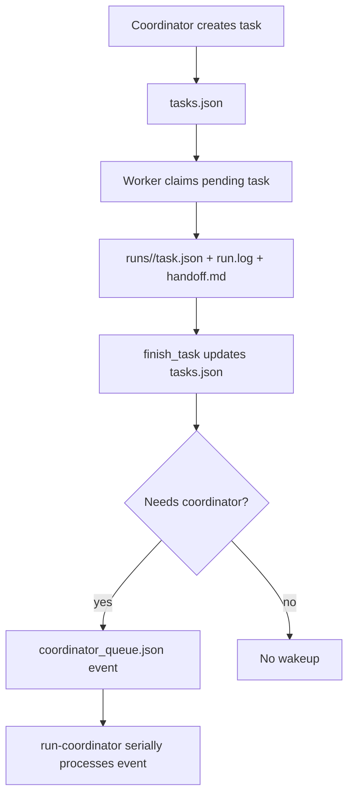

# Codex Collab Design Notes

## Truth Sources

- `tasks.json` is the task truth source.
- `coordinator_queue.json` is the coordinator wakeup truth source.
- `dashboard.md` is generated output only.

## Main Flow



## Queue Semantics

The queue is at-least-once, idempotent, and serial.

Event id:

```text
taskId + runId + status
```

`delivered` is not `resolved`. `codex exec resume` success means the coordinator was invoked; the runner must re-check `tasks.json` to know whether the task is actually resolved.

## Write Ordering

Use this ordering:

```text
1. Write run artifacts.
2. Update tasks.json final task status.
3. Enqueue coordinator event if needed.
```

This makes the crash window recoverable: if step 3 is missed, `repair-queue` can rebuild the event from `tasks.json`.

## Failure Handling

- Two workers finish together: queue lock and atomic write prevent lost updates.
- Worker crashes while running: stale recovery marks task failed and enqueues coordinator event.
- Coordinator runner crashes while event is running: lease timeout moves event to retry.
- Coordinator resume fails: attempts increments; event becomes retry or failed.
- User manually resolves task: reconcile marks active queue event resolved.
- Dashboard stale: regenerate from JSON truth.

## Product Commands

```bash
python .codex-collab/collab.py version
python .codex-collab/collab.py install --target /path/to/project --dashboard
python .codex-collab/collab.py doctor
python .codex-collab/collab.py doctor --live
```

- `version` prints runner and schema version.
- `install` copies the single-file runner into a target workspace and initializes JSON files.
- `doctor` checks local readiness for dry-run use.
- `doctor --live` also requires live Codex settings such as `coordinator.sessionId`.

## First-Version Boundaries

Included:

- file-based JSON queue
- queue lock
- repair-queue
- dry-run worker and coordinator paths
- live coordinator resume when sessionId is configured
- dashboard queue counts

Not included:

- watchdog
- SQLite
- external message queues
- service installers
- multiple coordinator sessions consuming the same queue
