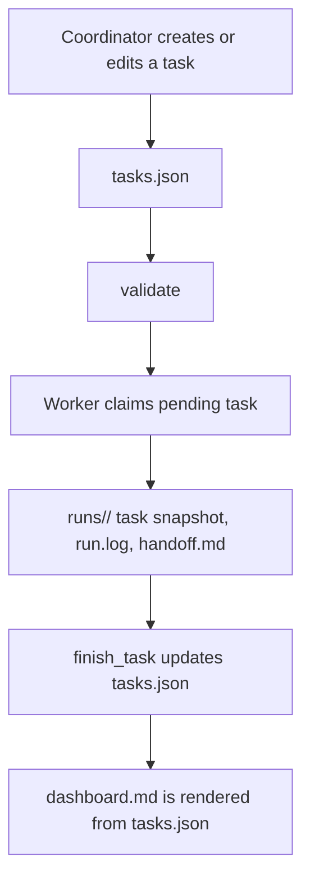
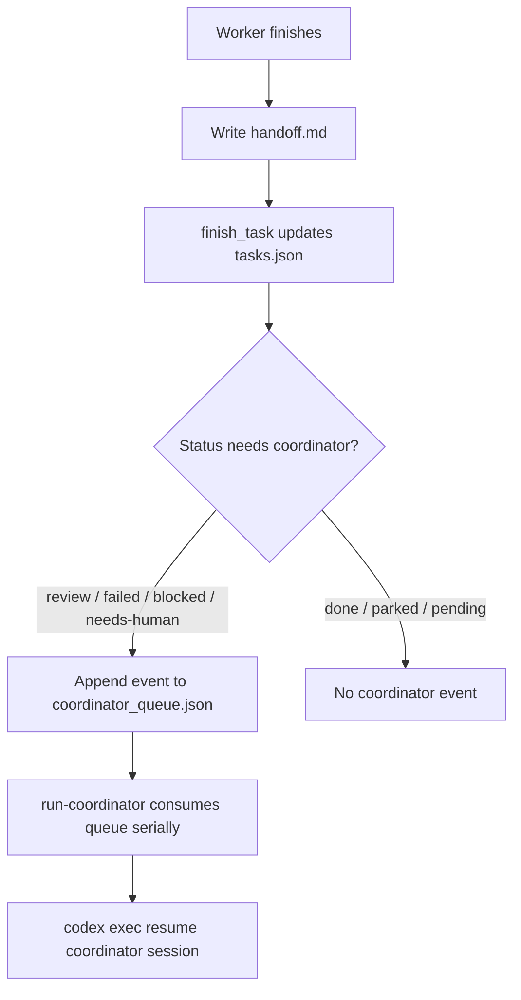
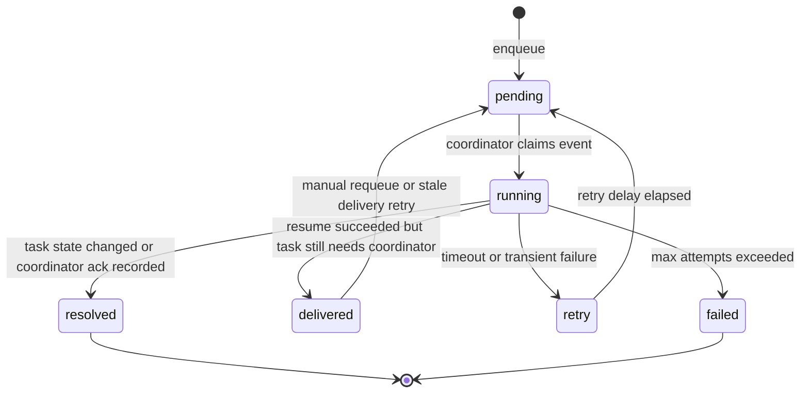
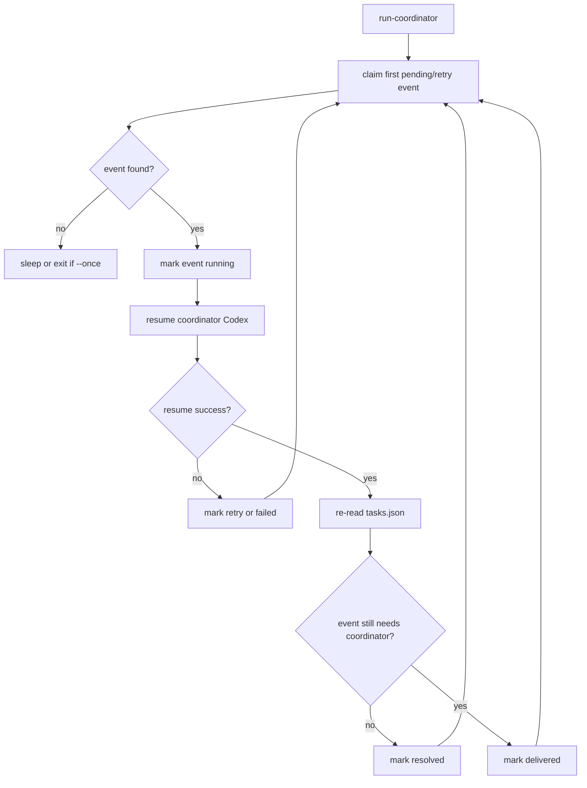

# Codex Collab Design Notes

This document records the architecture for the collaboration runner. It separates the implemented file-based queue from future extensions.

## Truth Sources

- `tasks.json` is the task truth source.
- `coordinator_queue.json` is the coordinator wakeup truth source.
- `dashboard.md` is generated output only.
- `runs/` stores execution evidence for each worker attempt.
- `state/` stores locks, heartbeat files, and stop files.

Workers do not parse the dashboard to find work. They read `tasks.json` directly.

## Main Flow



Plain version:

- `tasks.json` is the class assignment book. It is the source of truth.
- `dashboard.md` is the classroom board. It is for reading, not storing truth.
- `runs/` is scratch paper and submitted work for each attempt.
- `state/` is heartbeat, stop files, and locks.

## Coordinator Queue

When a worker finishes, the system actively enqueues a coordinator event. It does not rely on file-system change detection.



The queue is a durable line of workers waiting to talk to the coordinator. If three workers finish while the coordinator is busy, three queue events wait their turn.

Queue file:

```text
.codex-collab/coordinator_queue.json
```

Queue shape:

```json
{
  "schemaVersion": 1,
  "updatedAt": "2026-05-02T14:30:00+08:00",
  "events": [
    {
      "id": "TASK-001:20260502-143000-worker-a:review",
      "taskId": "TASK-001",
      "runId": "20260502-143000-worker-a",
      "status": "review",
      "kind": "handoff-review",
      "state": "pending",
      "createdAt": "2026-05-02T14:30:00+08:00",
      "attempts": 0,
      "lastError": ""
    }
  ]
}
```

Event identity:

```text
taskId + runId + status
```

That makes enqueue idempotent. The same handoff does not create duplicate events, but a retry with a new run id creates a new event.

Only the event matching the task's current `lastRunId/currentRunId` and current status is considered the active attention event. Older queue events are history. If a task is retried or moved back into review with a new run id, earlier `resolved`, `pending`, `retry`, or `running` events for the same task are superseded and should not keep producing diagnosis noise.

## Reliability Model

The queue is at-least-once, idempotent, and serial for coordinator wakeups.

At-least-once means a coordinator event may be delivered more than once after a crash, but it should not be lost.

Idempotent means duplicate discovery of the same task/run/status does not create duplicate queue events.

Serial means only one coordinator event is actively resumed into the main Codex session at a time.

Important distinction:

```text
notification delivered != task resolved
```

`codex exec resume` returning success proves the coordinator session was invoked. It does not prove the coordinator reviewed the handoff, accepted the task, retried it, or asked the user. The runner re-checks `tasks.json` after coordinator execution.

## Queue State Machine



The coordinator runner processes one event at a time.



`delivered` is not failure. It means the coordinator was notified, but the task still appears unresolved. This prevents a tight wakeup loop.

## Required Invariants

| Invariant | Reason |
|---|---|
| `tasks.json` remains the task truth source | Dashboard and workers can recover from it |
| `coordinator_queue.json` remains the wakeup truth source | Coordinator notifications are durable and serial |
| Event id is `taskId + runId + status` | Duplicate enqueue is safe |
| Queue writes use a queue lock and atomic replace | Multiple workers can finish concurrently |
| Coordinator runner claims only one event at a time | Main coordinator is not resumed concurrently |
| Runner re-checks task state before invoking coordinator | Manual changes do not trigger stale review |
| Runner re-checks task state after coordinator returns | Delivery and resolution are not confused |
| Stale `running` events have a lease timeout | Crashed coordinator runner can recover |
| `repair-queue` can rebuild missing pending events from `tasks.json` | Crash between finish and enqueue is recoverable |
| Queue events are tied to current run id and status | Old events do not wake the coordinator after a retry |

## Crash Windows And Recovery

| Window | What Can Go Wrong | Recovery |
|---|---|---|
| Worker claimed task but crashes before run starts | Task stays `running` | stale worker recovery marks task `failed`; enqueue failure event |
| Worker writes handoff but crashes before `tasks.json` update | Handoff exists but task stays `running` | stale recovery can inspect run dir and finish or fail the task |
| `tasks.json` updated but queue enqueue crashes | Task needs coordinator but no event exists | `repair-queue` enqueues missing event |
| Two workers finish at the same time | Concurrent queue writes conflict | queue lock + atomic write; event id dedupe |
| Coordinator runner marks event `running` then crashes | Event remains running forever | lease timeout moves event to `retry` |
| Coordinator resume times out | Unknown whether coordinator saw prompt | retry with attempts limit; prompt must be idempotent |
| Coordinator resume succeeds but does not change task | Event should not loop forever | mark `delivered`; expose unresolved task in dashboard |
| User manually resolves task while event pending | Event is stale | runner re-checks task state and marks event `resolved` |
| Task retries after an old event was resolved | Old event is historical | validator treats it as superseded; repair/runner create or process the new run event |
| Queue file is corrupted | Events cannot be read | keep last-good backup; repair from `tasks.json`; unresolved tasks can be requeued |
| Dashboard is stale | Human sees old view | regenerate from JSON truth |

## Write Ordering

The file-based design does not have a true cross-file transaction between `tasks.json` and `coordinator_queue.json`. The safe ordering is:

```text
1. Write run artifacts.
2. Update tasks.json with the final task status.
3. Enqueue coordinator event if the final status needs attention.
```

This ordering prefers a recoverable missing queue event over a queue event pointing at a task state that has not been committed yet.

If the process crashes after step 2 and before step 3, `repair-queue` can rebuild the missing queue event from `tasks.json`.

If the process crashes after step 3, the event already exists and idempotent enqueue prevents duplicates.

The coordinator runner also re-checks the referenced task before resuming the coordinator session. If the task no longer needs attention, the event becomes `resolved` without calling Codex.

## Why Not File Watchdog First

Python `watchdog` is a file-system event library. It can ring a bell when `tasks.json` changes. That is useful for speed, but it should not be the source of reliability.

Reasons:

- file events can duplicate
- platform behavior differs across Windows, Linux, and macOS
- events are lost while the process is not running
- one atomic write can still produce multiple modify events

The stable trigger is the worker's fixed exit path:

```text
finish_task -> enqueue_coordinator_event
```

Polling or watchdog can be added later only as an acceleration layer. The durable queue remains the truth for coordinator wakeups.

## Extreme-Case Review Framework

| Case | Expected Behavior |
|---|---|
| Two workers finish at the same time | Both events are appended once under a queue lock |
| Coordinator is already running | New events remain pending until the current event completes |
| Worker crashes before handoff | Task becomes failed/stale; repair-queue can enqueue review if needed |
| Process crashes after tasks.json update but before enqueue | repair-queue detects missing event and enqueues it |
| Queue event is running forever | timeout moves it to retry or failed |
| Coordinator resume fails | attempts increments; event becomes retry or failed |
| Same task is retried | New run id creates a new event |
| Same event is discovered twice | event id prevents duplicate enqueue |
| Old event remains after a retry | Old event is superseded by the current run/status and ignored for wakeup |
| Dashboard is stale | dashboard can be regenerated from JSON truth |
| Main coordinator changes task status manually | queue processor re-checks task status before resuming |

Use four buckets when reviewing new edge cases:

| Bucket | Question |
|---|---|
| Concurrency | What if two processes do this at the same time? |
| Crash recovery | What if the process dies between step A and step B? |
| Idempotency | What if the same event is created, delivered, or retried twice? |
| Human override | What if the user or main coordinator changes state manually? |

## Implemented Boundary

Included:

- file-based JSON queue
- queue lock with stale lock cleanup
- enqueue from `finish_task`
- idempotent `repair-queue`
- `run-coordinator --once`
- `run-coordinator --dry-run`
- serial event claim
- retry counter and max attempts
- lease timeout for stale `running` events
- dashboard rendering for coordinator queue counts

Not included:

- watchdog
- external message queues
- SQLite
- background service installers
- automatic deletion of old queue history
- multiple coordinator sessions processing the same queue

## Config

`config.json` includes a coordinator section:

```json
{
  "coordinator": {
    "sessionId": "",
    "model": "",
    "pollSeconds": 5,
    "codexTimeoutSeconds": 1800,
    "maxAttempts": 3,
    "leaseMinutes": 60,
    "notifyStatuses": ["review", "failed", "blocked", "needs-human"]
  }
}
```

If `sessionId` is empty, `run-coordinator` refuses live mode and explains how to configure it. `--dry-run` still works.

## Queue Validation

`validate` checks both `tasks.json` and `coordinator_queue.json`.

Queue validation should flag:

- duplicate event ids
- event references to missing task ids
- event references to missing run ids when run evidence is expected
- invalid event states
- `running` events past lease timeout
- active events that no longer match the task's current run/status
- `resolved` events only when they still match the task's current run/status and the task still needs coordinator attention
- queue file schema mismatch

Historical `resolved` events for earlier runs are not warnings. They are retained as audit history.

## Codex CLI Invocation

Live worker and coordinator execution share one launch path:

```text
resolve codex with shutil.which("codex")
-> if Windows and the resolved file is .cmd/.bat, call cmd.exe /d /c <resolved> ...
-> otherwise execute the resolved file directly
-> send the prompt through stdin with "-"
-> capture stdout/stderr as UTF-8 with errors="replace"
-> write a UTF-8 run log
```

The runner avoids passing the full prompt as a command-line argument. This matters on Windows because npm shims often resolve to `.CMD` files and multiline prompts are fragile when routed through `cmd.exe`.

Captured CLI output is not decoded with the process locale. It uses explicit UTF-8 replacement decoding so a Codex message containing non-ASCII output does not crash the runner under Windows GBK or other legacy locales.

## Implementation Principles

- Keep `tasks.json` as the task truth source.
- Keep `coordinator_queue.json` as the coordinator wakeup truth source.
- Use lock files for writes that can happen from multiple processes.
- Do not parse `dashboard.md` as input.
- Prefer pure Python and no external services for the first durable version.
- Add watchdog later only if latency matters.
